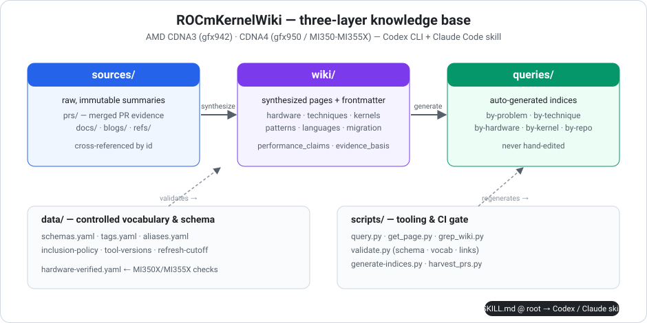

# ROCmKernelWiki — AMD CDNA / RDNA Kernel Optimization Knowledge Base

A structured, agent-queryable knowledge base of **AMD Instinct & Radeon GPU kernel
optimization** for CDNA3 (gfx942 / MI300), CDNA4 (gfx950 / MI350–MI355X), and RDNA4
(gfx1201), **packaged as a Claude Code skill**. The repository root **is** the skill
directory — clone it into `~/.claude/skills/` and it works out of the box.

> **Corpus dates:** merged-PR harvest through **2026-05-30**; each doc/blog page
> carries its own retrieval date. The nod-ai AMDGPU optimization guide is synced
> through commit `efa471ae` on **2026-07-20**. Tool versions remain pinned in
> [`data/tool-versions.yaml`](data/tool-versions.yaml). gfx950 facts and examples
> were verified on MI350X, with guide-specific device/LDS checks repeated on
> MI355X — see below.

## Hardware Scope

| Marketing | gfx | Arch | FP8 | Matrix unit | Wave |
|---|---|---|---|---|---|
| MI300A / MI300X / MI325X | `gfx942` | CDNA3 | **FNUZ** | MFMA | wave64 |
| **MI350X / MI355X** | **`gfx950`** | **CDNA4** | **OCP** + FP6/FP4/MX | MFMA | wave64 |
| Radeon AI PRO R9700 | `gfx1201` | RDNA4 | OCP | **WMMA** | wave32/64 |

> The headline portability gotcha: **gfx942 FP8 (FNUZ) is not bit-compatible with
> gfx950 FP8 (OCP)**. See [`wiki/migration/gfx942-to-gfx950.md`](wiki/migration/gfx942-to-gfx950.md).

## Validated on real silicon (MI350X and MI355X / gfx950)

Unlike a docs-only wiki, the gfx950 claims here were **checked on an actual AMD Instinct
MI350X** (ROCm 7.2) by compiling, running, and disassembling code — each finding re-run by
an adversarial second pass. Full evidence: [`VERIFICATION.md`](VERIFICATION.md) and
[`data/hardware-verified.yaml`](data/hardware-verified.yaml).

The 2026-07-20 guide sync additionally ran on MI355X/ROCm 7.1.1: HIP reported
256 CUs, wave64, 32 waves/CU, and 160 KiB LDS; the upstream empirical-LDS
harness reproduced 64 banks plus the b32/b64 phase groups. Its b128 classifier
was inconclusive and MI300X SSH access was unavailable, both recorded as limits
in [`VERIFICATION.md`](VERIFICATION.md).

- **Hardware facts re-grounded on silicon** and corrected where the GPU disagreed with the
  docs: gfx950 cross-lane is `v_permlane16_swap` (not the RDNA selector form); **32 waves/CU**
  (not 40); direct-to-LDS is ≤16 B on gfx950 / ≤4 B on gfx942; compute modes SPX/DPX/QPX/CPX,
  memory NPS1/NPS2; native `xf32` MFMA *fails to select* on gfx950.
- **All 12 runnable examples** build with `--offload-arch=gfx950` **and execute** on the GPU
  (11/12 self-check; `fp8-gemm`'s `main()` only verifies the emitted MFMA, no numeric check).
- **First-party FlyDSL kernel sweep on MI350X** — every major FlyDSL gfx950 kernel was
  profiled with rocprofv3 ATT + counters against matched AITER/CK/hipBLASLt baselines.
  The detailed verdict table, root-cause notes, and dashboard links live in the
  canonical [`ref-flydsl-kernel-profiling`](sources/refs/ref-flydsl-kernel-profiling.md)
  source page; synthesized pages link back to it instead of duplicating the full summary.

## What's Here

- **7,400+ PR reference pages** from ROCm/composable_kernel, ROCm/aiter,
  ROCm/hipBLASLt, ROCm/Tensile, ROCm/rocBLAS, ROCm/flash-attention, ROCm/FlyDSL,
  ROCm/triton, plus ROCm-filtered vllm-project/vllm and sgl-project/sglang
- **~54 synthesized wiki pages** — hardware features, optimization techniques,
  kernel case studies, problem patterns, DSL/language guides, migration guides
- **20 doc/blog summaries** (AMD CDNA3/CDNA4 ISA, whitepapers, ROCm blogs) and
  **9 reference-repository studies** (FlyDSL, the FlyDSL MI350X profiling sweep,
  gcnasm, Composable Kernel, rocWMMA, AITER, hipBLASLt, Tensile, the Matrix Instruction Calculator)
- **9 candidate ledgers** in `candidates/` recording the include/defer/exclude
  decision for every scanned PR
- **6 auto-generated cross-reference indices** under `queries/`
- **959 real upstream PR diffs** under `artifacts/prs/<repo>/PR-<N>/` (byte-capped, SHA-256-pinned via `PROVENANCE.yaml`)
- **12 runnable kernel examples** under `examples/` — compiled with hipcc; all 12 build with
  `--offload-arch=gfx950` and run on an MI350X (see [`VERIFICATION.md`](VERIFICATION.md))

## Install as a Claude Code Skill

```bash
git clone https://github.com/jhinpan/ROCmKernelWiki ~/.claude/skills/ROCmKernelWiki
pip install -r ~/.claude/skills/ROCmKernelWiki/requirements.txt
```

The skill auto-registers (`SKILL.md` lives at the clone root) and the query
scripts auto-resolve the wiki root to their own directory — no environment
variable required. Optional override: `export ROCM_WIKI_ROOT=/path/to/ROCmKernelWiki`.

Smoke test:

```bash
cd ~/.claude/skills/ROCmKernelWiki
python3 scripts/query.py --tag mfma --type hardware --compact
python3 scripts/get_page.py kernel-flydsl-flash-attention --frontmatter-only
```

## Query Tools

| Tool | Purpose |
|---|---|
| `scripts/query.py` | Unified search (keywords + filters + alias-aware) |
| `scripts/get_page.py` | Fetch any page by `id` or path; `--follow-sources` |
| `scripts/grep_wiki.py` | Regex text search across wiki bodies and PR pages |

```bash
python3 scripts/query.py "flash attention ck-tile" --limit 5
python3 scripts/query.py --architecture MI355X --type kernel       # alias → gfx950
python3 scripts/get_page.py kernel-flash-attention-ck --follow-sources
python3 scripts/grep_wiki.py "v_mfma_f32_16x16x128_f8f6f4" --only wiki
```

## Architecture

Three layers (after MIT Han Lab's KernelWiki, in turn after Karpathy's LLM-wiki):

<p align="center"></p>

1. **`sources/`** — Raw data. Immutable summaries of PRs, docs, blogs, and reference
   repos. Cross-referenced by `id`.
2. **`wiki/`** — Synthesized knowledge pages with YAML frontmatter (subfolders:
   `hardware`, `techniques`, `kernels`, `patterns`, `languages`, `migration`).
3. **`queries/`** — Auto-generated cross-reference indices. Do not edit by hand;
   regenerate via `scripts/generate-indices.py`.

Supporting files: `data/` holds the schema and controlled vocabulary
(`schemas.yaml`, `tags.yaml`, `aliases.yaml`, `inclusion-policy.yaml`,
`tool-versions.yaml`, `refresh-cutoff.yaml`, `hardware-verified.yaml`);
`candidates/` holds per-repo PR ledgers; `references/` holds the primer, schema, and
worked examples.

## Maintenance Tooling

| Script | Purpose |
|---|---|
| `scripts/harvest_prs.py` | Harvest merged PRs from tracked ROCm repos (gh GraphQL) |
| `scripts/backfill_diffs.py` | Fetch real upstream diffs for top-ranked kernel PRs |
| `scripts/enrich_facets.py` | Infer techniques/hardware_features/kernel_types from paths + diffs |
| `scripts/link_prs.py` | Build the bidirectional PR↔wiki bridge |
| `scripts/gen_source_anchors.py` | (Re)generate doc/blog/ref source anchor pages |
| `scripts/generate-indices.py` | Regenerate `queries/*.md` from frontmatter |
| `scripts/validate.py` | Validate frontmatter, vocabulary, links, version-claims, freshness |

CI (`.github/workflows/ci.yml`) gates every push on the validator, the query-tool
smoke tests, and index freshness.

```bash
pip install -r requirements.txt
python3 scripts/validate.py            # schema + vocabulary + link integrity
python3 scripts/generate-indices.py    # regenerate query indices
```

### Quality Gates

- 0 validation errors (schema, controlled vocabulary, link integrity)
- Every hardware fact traces to an official AMD ISA doc / whitepaper
- Every technique/kernel/language page has a compilable code snippet
- Every PR page carries `inclusion_reason` and `status: merged`
- `verified` pages carry `evidence_basis` (official-doc + upstream-code/paper)
- 0 dangling internal references (frontmatter ids **and** in-body relative links)
- **gfx950 hardware/numeric claims re-verified on real MI350X silicon (ROCm 7.2)** —
  see [`VERIFICATION.md`](VERIFICATION.md) and [`data/hardware-verified.yaml`](data/hardware-verified.yaml)

## License

Tooling and scripts are released under **Apache-2.0** (see [`LICENSE`](LICENSE)).
Wiki synthesis pages are derivative works that cite their upstream sources; PR
summary pages link to and summarize publicly available upstream PR metadata, with
the upstream repositories remaining the authoritative source of truth. AMD,
Instinct, Radeon, CDNA, and ROCm are trademarks of Advanced Micro Devices, Inc.;
this project is unaffiliated with AMD. It is **not** an official AMD or ROCm product.

## Acknowledgements & Citation

This project is **inspired by and modeled on** the excellent
[**KernelWiki**](https://github.com/mit-han-lab/KernelWiki) from **MIT Han Lab** —
their structured, agent-queryable knowledge base for NVIDIA Blackwell/Hopper kernel
optimization. ROCmKernelWiki adapts the same three-layer architecture
(`sources/` → `wiki/` → `queries/`), the YAML-frontmatter page schema, and the skill
packaging, retargeting all content to the AMD/ROCm ecosystem. The KernelWiki three-layer
design itself follows
[Karpathy's LLM-wiki pattern](https://gist.github.com/karpathy/442a6bf555914893e9891c11519de94f).

If you use this knowledge base, please cite both:

```bibtex
@misc{rocmkernelwiki2026,
  title  = {ROCmKernelWiki: An AMD CDNA/RDNA GPU Kernel Optimization Knowledge Base},
  author = {ROCmKernelWiki contributors},
  year   = {2026},
  howpublished = {\url{https://github.com/jhinpan/ROCmKernelWiki}},
  note   = {Inspired by MIT Han Lab's KernelWiki}
}

@misc{kernelwiki2026,
  title  = {KernelWiki: Blackwell \& Hopper Kernel Optimization Knowledge Base},
  author = {MIT Han Lab},
  year   = {2026},
  howpublished = {\url{https://github.com/mit-han-lab/KernelWiki}}
}
```
